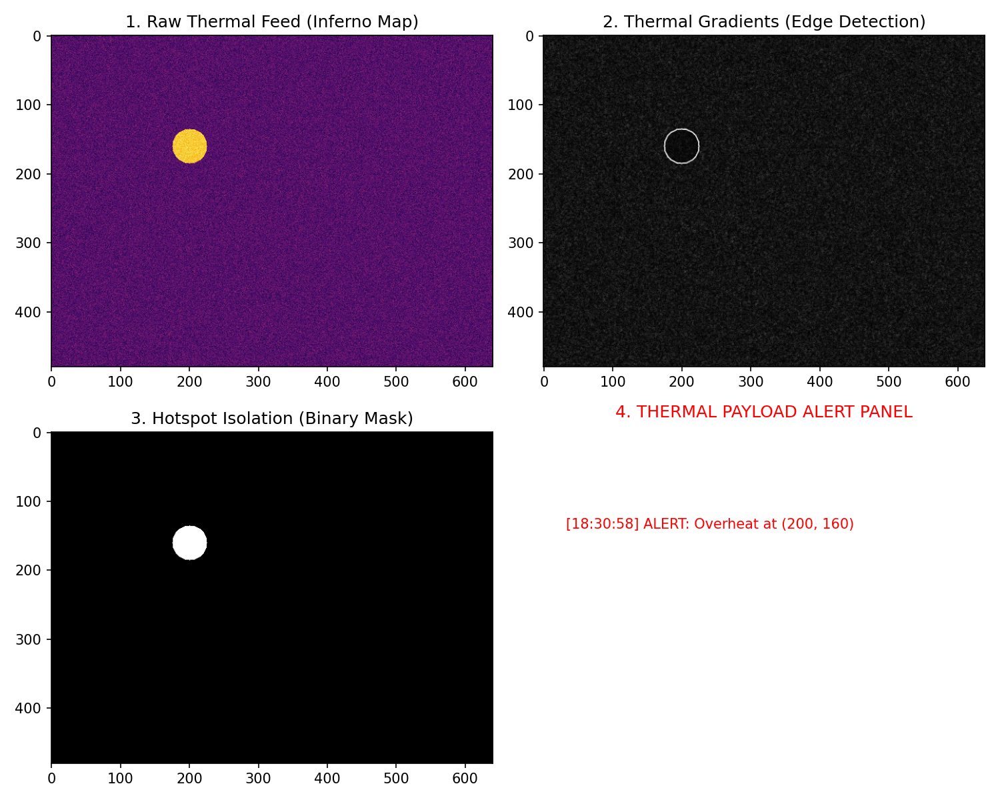

# Drone Thermal Payload Monitoring & Alerting System

Thermal image analysis system built in Python to detect overheating sections 
in drone payloads using thermal sensor data.

## Overview
This project simulates a thermal monitoring pipeline: loading thermal frame 
data, extracting temperature gradients, isolating hotspots, and triggering 
real-time overheat alerts.

## Approach
- Simulated thermal frame data (ambient background + hotspot region)
- Extracted thermal gradients using NumPy and OpenCV (Sobel edge detection)
- Isolated hotspots using a threshold-based binary mask
- Built an alert system that logs overheat events with coordinates and timestamps

## Tools Used
Python, NumPy, OpenCV, Matplotlib

## Output

## Note
This is a documented/rebuilt version of a first-semester coursework project. 
The original implementation code was misplaced; this reflects the same 
approach and logic used in the original project.
